# Hanna Roads System

This is a Unity road system, with that you can build amazing roads with a lot a features!

## How to use

### Creating a simple road system

- Go to top menu select Hanna Roads and then "Create Road System".

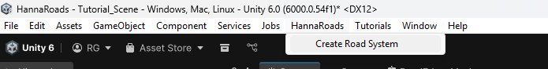

- To start building a road select HannaRoad Object created in the hierarchy.

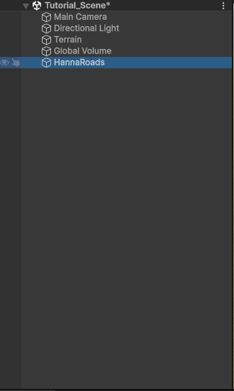

- When you hold Shift you will see a little wire cube.

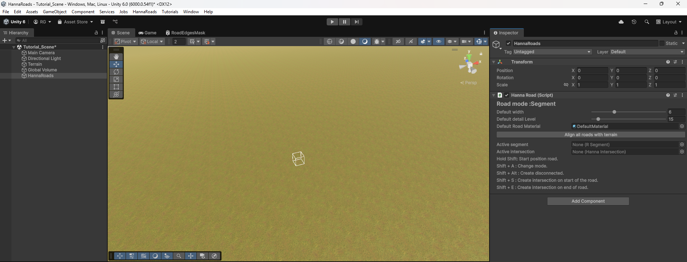

- Click with left mouse button to create and keep holding shift to choose where to go with the end of the road.

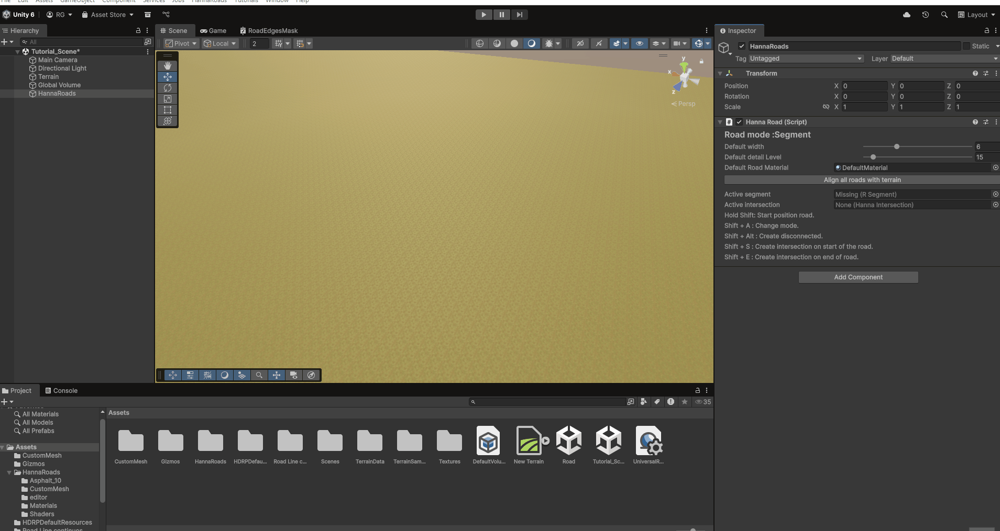

- To confirm the creation of the road click with left mouse button again and voilà a new amazing road! If want to cancel, just release shift key.

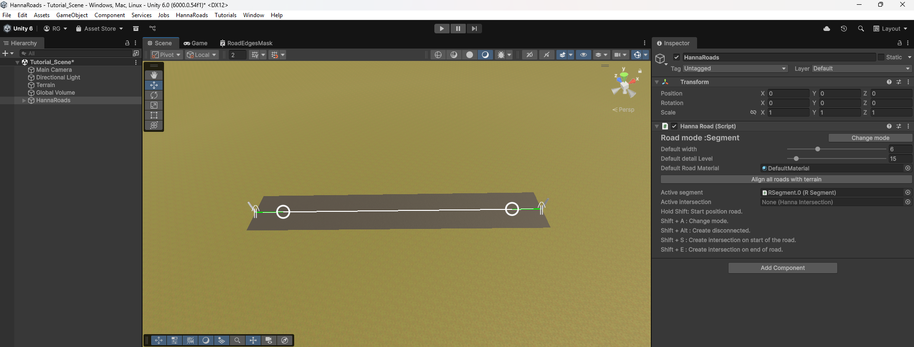

### Controlling the road

When you create a new road you will see circles with a green line and a white cube towers, the roads are Bézier curves, the circles are the controllers of the Bézier curve, when you move then they will change the shape of the road, with that you can create a nice curves without need to create more roads. If you need to move the road use the towers to change shape of the road.

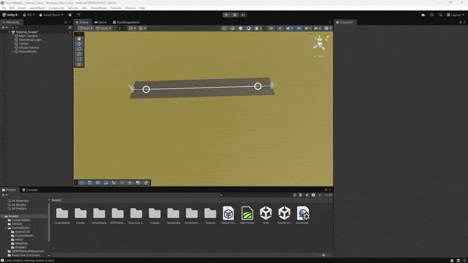

You can delete the road freely, when you delete the road they will disconnect from other roads, remember, if you need to delete a road, delete the segments, deleting reference points, control points or important objects can cause erros, if you accidentally delete some of this objects, delete the segment and create another, you can mark other road as active and keep making more roads.

### How connection works

Hanna roads can create connected roads and disconnected roads, after creating your first road, if you try to create another road the start of the road will be the end of the previous one.

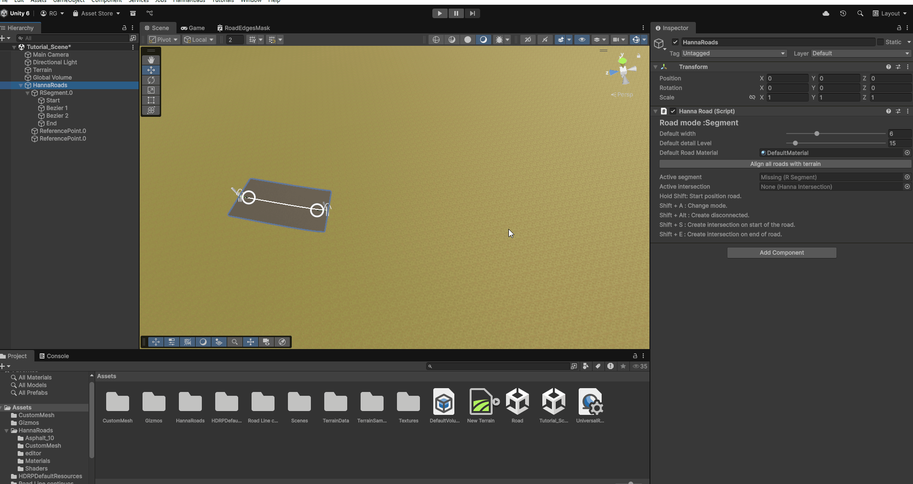

If you don´t need that before you click with the left mouse button for the first time you can hold alt key when holding shift, the wire cube will become green and you will be able to create a disconnected road.

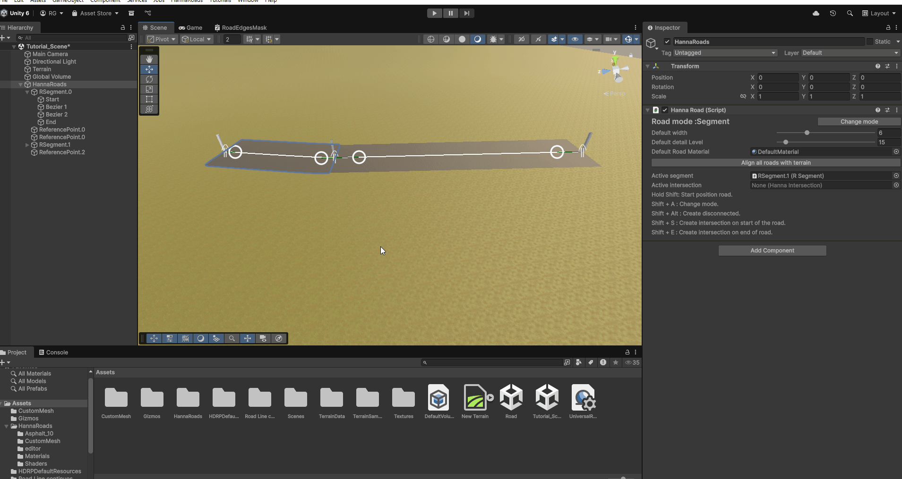

### Active Segment

Hanna roads have segments and intersections, when you create a road you are creating a segment, when a segment is created they become the active segment, you can verify looking to Hanna Road game object and see in the field "active segment", you will see an active intersection too(we will talk about that later in this document), when you create a new road that will be connected to another road Hanna road will get the active segment to connect the roads,

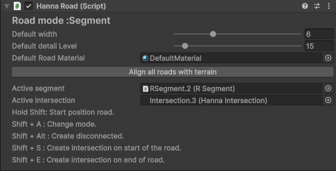

if you need to start a new road from another segment you can simple select the segment you need and click "Set as Active", when you return to Hanna roads object you can see in the active segment field the road you have marked as active.

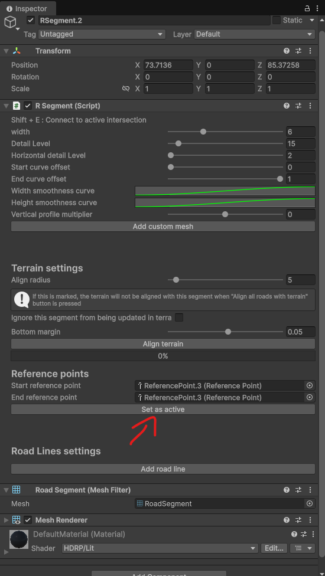

### Intersections

Let´s talk about intersections, you have multiple ways to create an intersection, let´s go to the easy way. Select your Hanna Road object, you will see a "Change mode" button, change mode to intersection(you need to have at least one road in the scene to change mode). you will see a "Road mode" change to intersection.
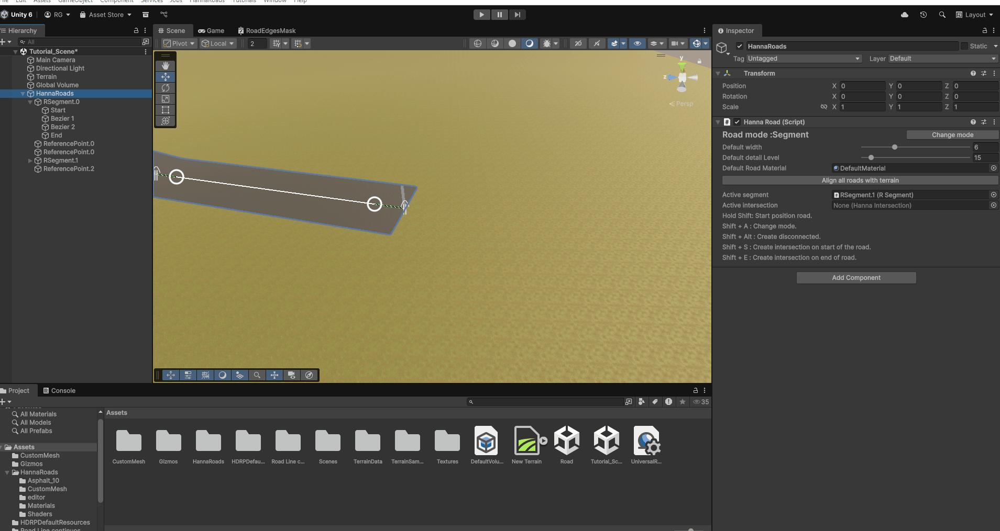

After that you have two options, create at the start of the road, or create at the end of the road, you can hold shift and press E to create at the end or S to create at the start, if the road is connected with another road at the end will not be possible to create at the end and vice-versa

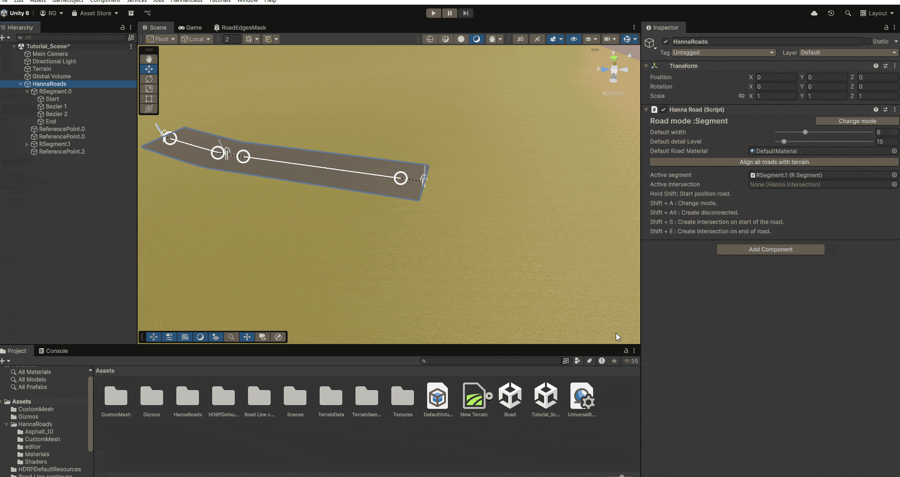

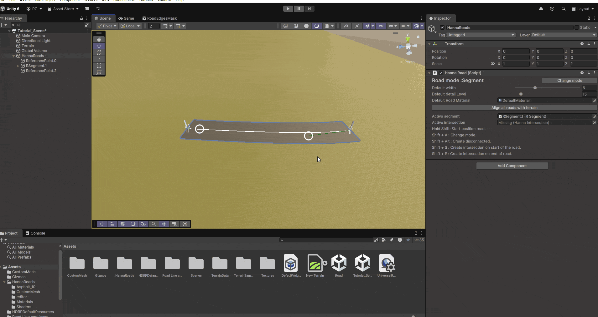

After that if you change mode to intersection and try to create another connected road, you will see the start of the new road be a point of the intersection, if you scroll your mouse you will see the road change from one intersection connection to another.
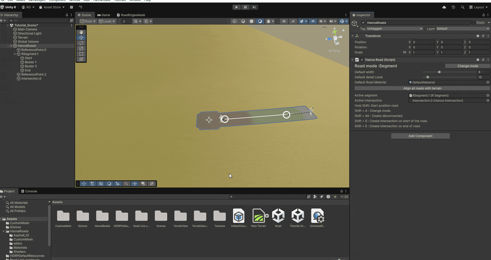

#### **Warning**

**_When you create the road that start from intersection you probably will see two roads connected to same connection, just scroll the mouse to change to another connection point._**

If you need to change connection you can select the white cube tower connected to intersection that is called Reference point, in that you can can change intersection position in a slider.

### Active intersections

As we have active segments we have active intersections too, as you see when we have an active intersection and using intersection mode, the road starts from that active intersection, but you can do more things.

If you select a reference point, and press shift + e the reference point will be attached to the active intersection and connecting the road with the intersection

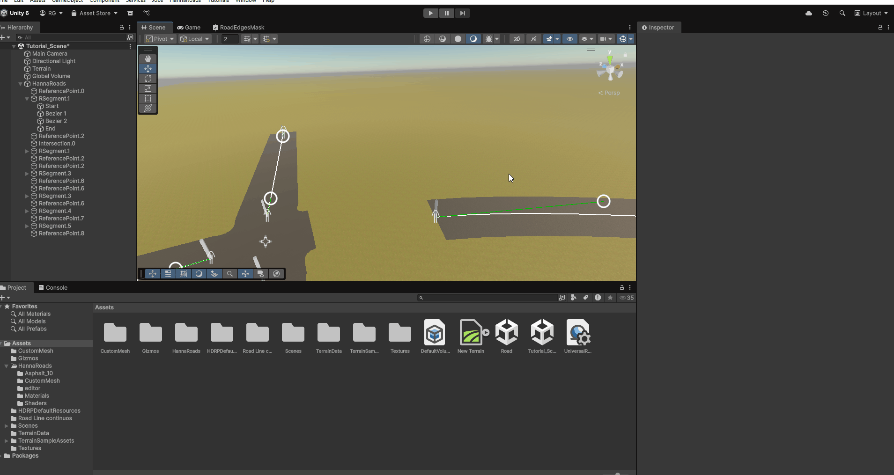

If you want to disconnect, click on the "Intersection connected" field and press delete key to remove reference, now you can move reference point freely, you can drag and drop intersection object to intersection field in the reference point too.

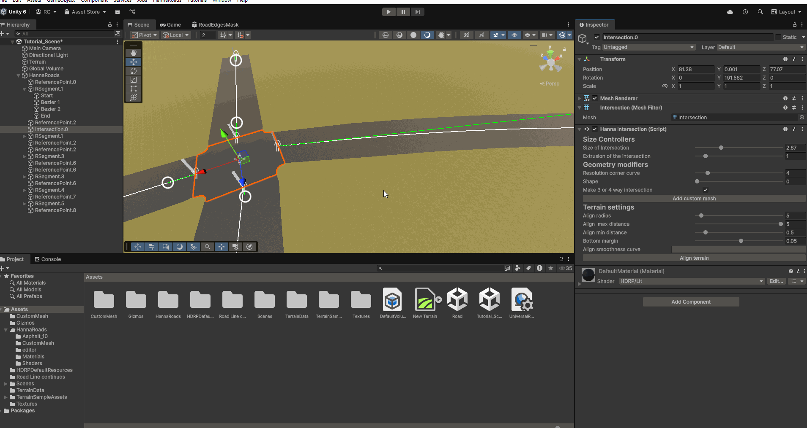

When you click on the reference point you can se a button called "Add Intersection", pressing this button will create a intersection at reference point position.
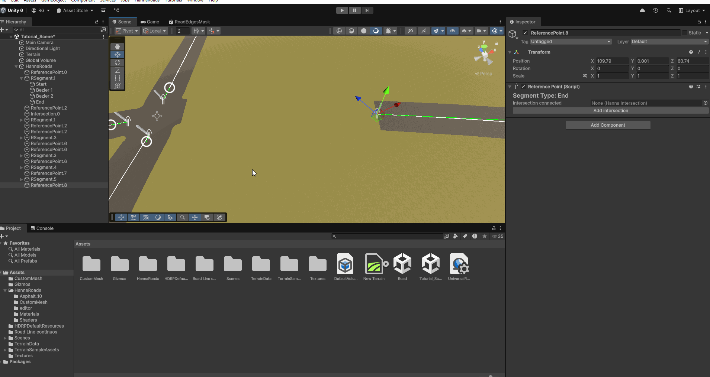

### Connecting separated roads and making loop roads

You probably will need to connect two roads, or create road loops, to do that select two reference points and this two need to be a start reference point and a end reference point, in other words the start and the end of the roads, to know that you can select the reference point and see the segment type, or looking for colors of the towers, if is white is the start if is little bit darker is the end. After selecting this two click "Connect", another road will be created to connect the roads.
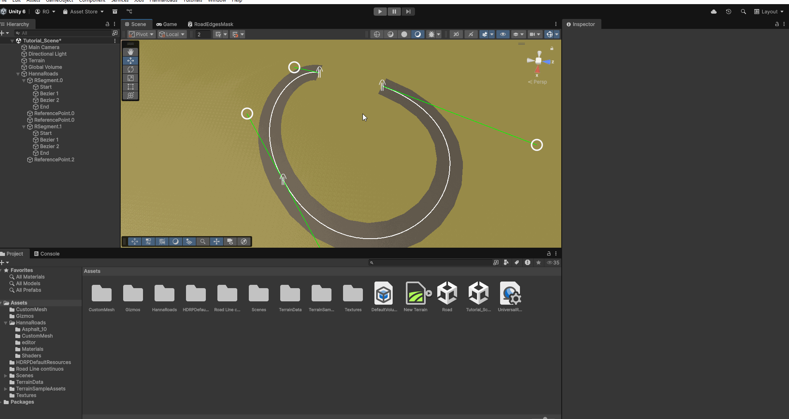

## Changing road and intersection shapes and geometry

With Hanna Roads you can make cool things, but let start from the basics.

### Road Segment geometry customization

When you select a segment you will find some settings:

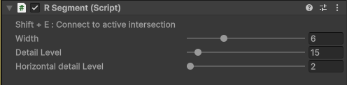

- Width : Change the width of the road
- Detail Level : Change the number of cuts(edges) of the road, more cuts, more detail
- Horizontal detail leve: Add cuts horizontally to the road creating extra detail, you will need that to create custom shapes.

This is the basic, but only that is boring, let´s make cool stuff!

After basic settings you will see a important settings to create custom road shapes.

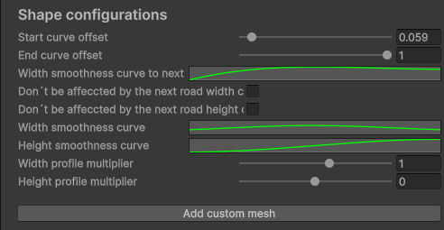

Ok it´s a lot of settings, let´start with a easy stuff to you understand, lets change height profile.

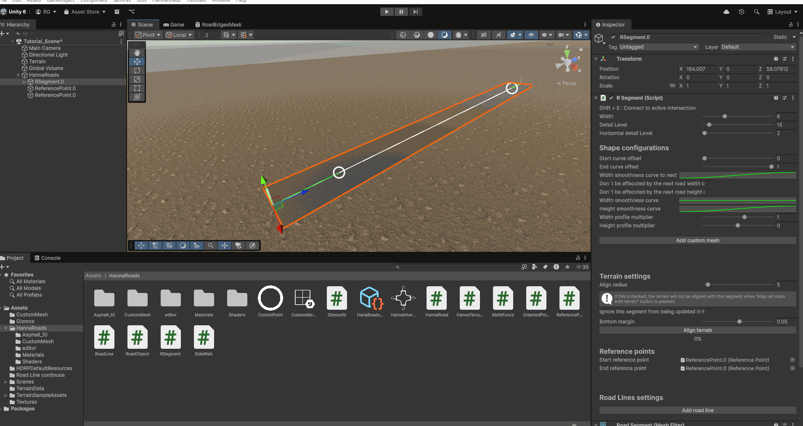

Wow! the road start to bend!
This happens because of the height smoothness curve, if you see the curve they are lower at start and high at end, Hanna roads create a shape based on this curve, if you change the curve, the shape of the road will change, with that you can create crazy shapes, you can adjust using vertical multiplier and increasing Horizontal detail level, cool right?

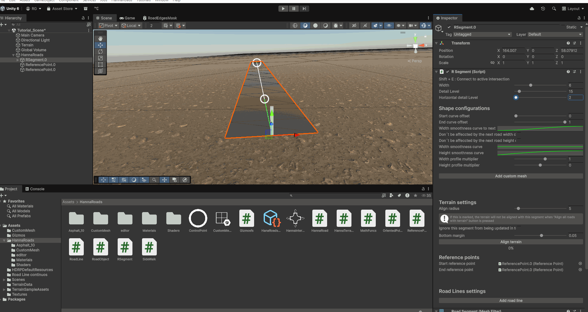

But we can do more! Lets see what we can make with the width of the road!

If you open Width smoothness curve you will see a constant curve, try to add some key values and make some changes.

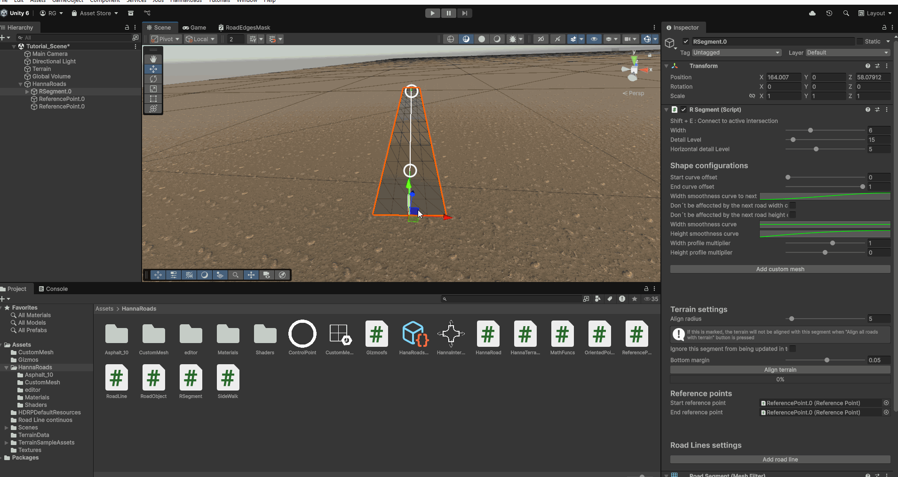

See that? The width of the road start to change belong the road, the width of the road is affected by this curve, if the curve is constant nothing happens, but if you change they will affect road width, you can adjust more with Width profile multiplier.

#### Affecting previous road

Ok thats great, but if we create another road and change size of the road or other settings that change the shape of the road the previous one will be affected.

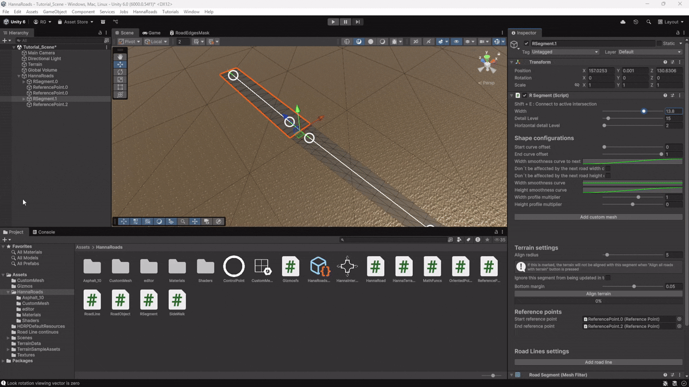

Hanna roads create a blend between some settings of previous road to the next, but you can control that! You will see two fields called "Start curve offset" and "End curve offset", this two values controls when the "Width smoothness curve to next" will start and end, this particular field controls the blend between settings of the current road to the next road, such as width, height curve, width curve and etc.

if you don´t need road to be affected by the next road, mark "Don´t be affected by the next road width" or "Don´t be affected by the next road height", and the road will not blend to next road.

With that settings you can create amazing and crazy roads!

### Custom Meshes

Ok, we have seen a coll things, but let´s do some more advanced stuff. Custom Meshes!
Custom meshes allow you bend object along the road, with that you can create sidewalks for example, let´s make a nice side walk.

Open your favorite 3D Software, I will use Blender. Now make the sidewalk you want, the side walk will be a little segment of the sidewalk and then will be repeated along the road.

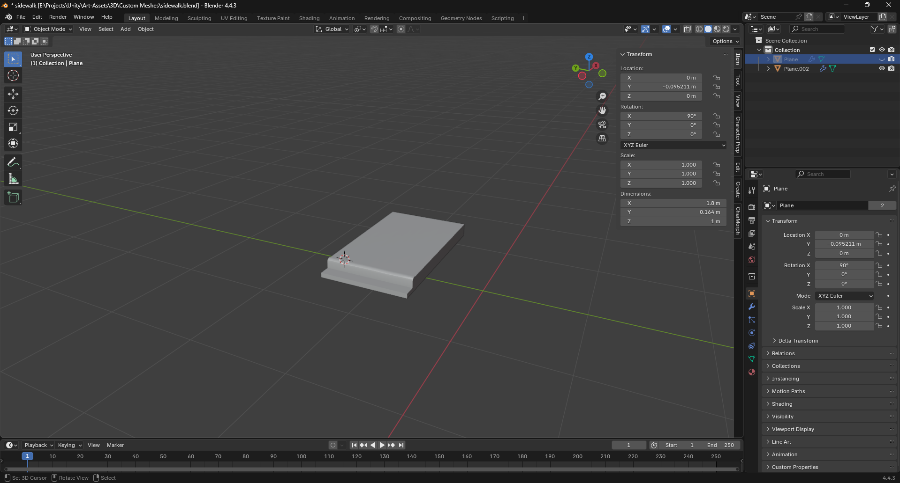

Before export the model we need to fix somethings, first make the origin point be the start of sidewalk, hanna roads convert Z axis of the vertices position to a Z axis of the road, to prevent negative position make you origin in some point that all vertices will be positive,
make all vertices be positive in Z axis it´s not require, if you want that for some reason you can, but for this example we will need to be positive.

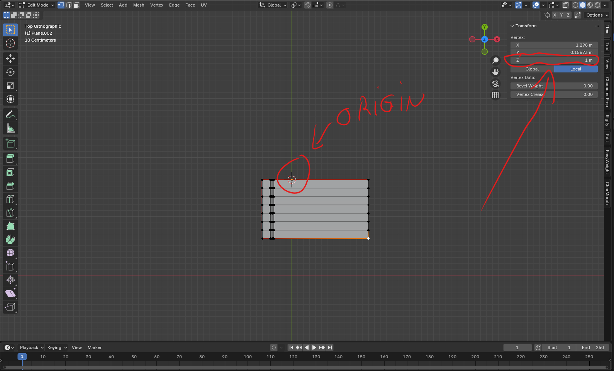

As you can see in the Transform tab in Blender Y position of the vertice is positive, after export to Unity Y axis will become Z axis, because in Blender up axis is Z, and in Unity is Y. After this changes your model need to have this orientation.
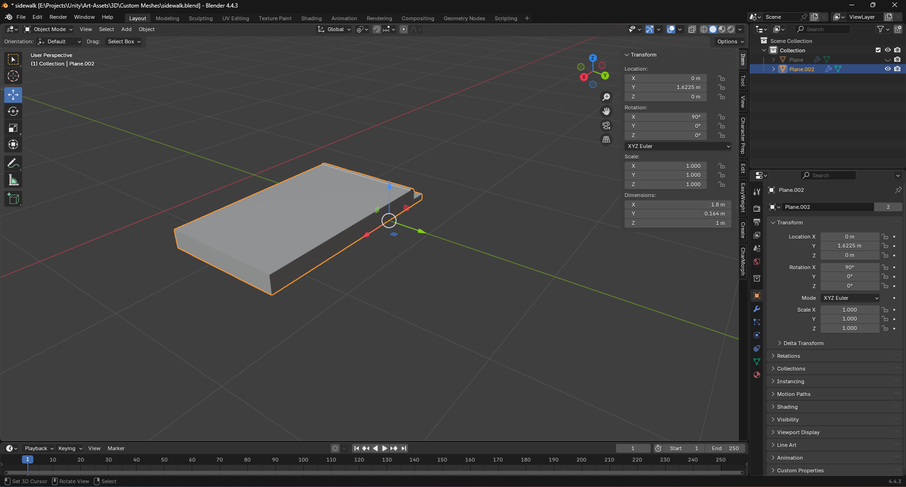

After that to prevent rotation issues, rotate your model 90 degrees in X axis, now apply rotation, now you are ready to export.  
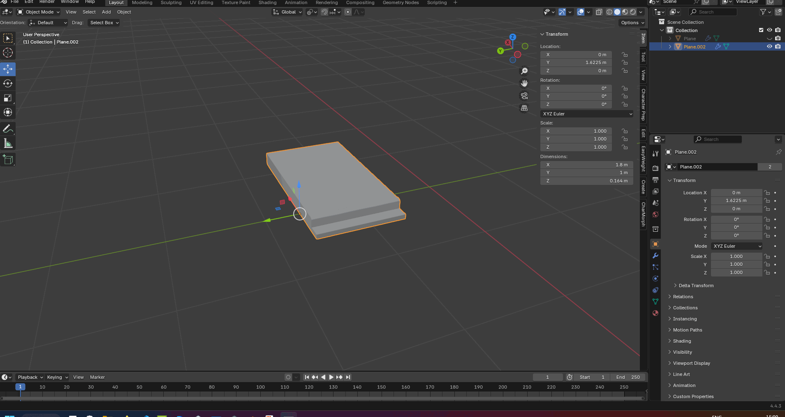

After export your model, go back to Unity, select some road segment, and click "Add custom mesh"

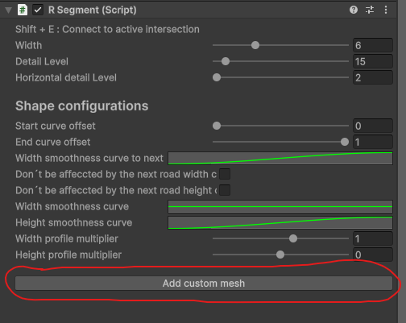

Now select the Custom Mesh created as a child of rSegment

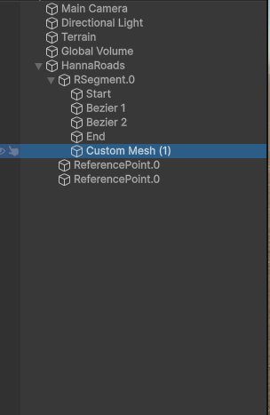

In Custom Mesh you will see some settings

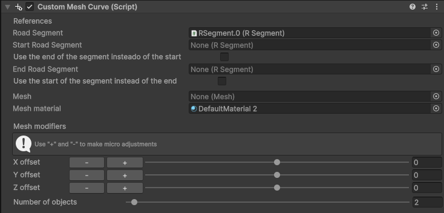

For now let´s add a simple mesh, select your exported object, go to model Tab and mark read/write checkbox.
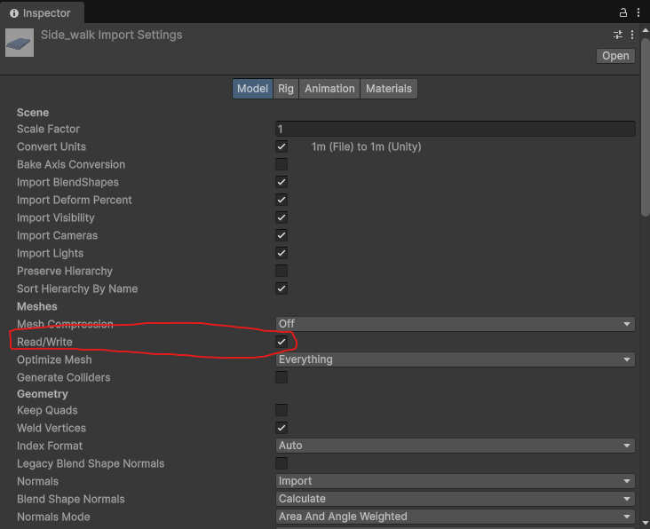

Now you can grab you mesh and drag into Mesh field of the Custom Mesh, or selecting your Mesh clicking in the field
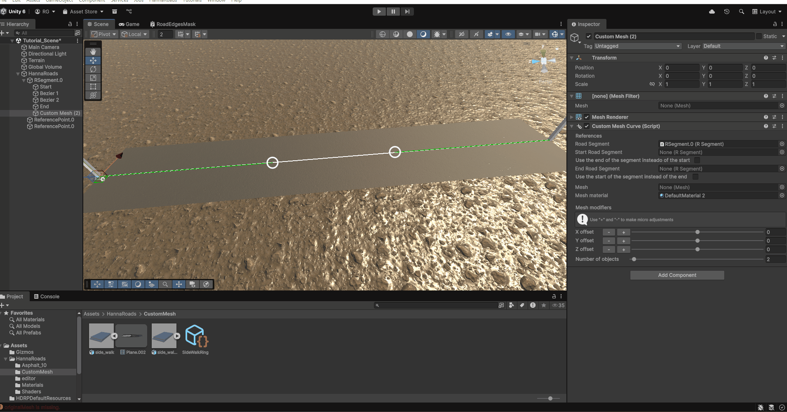

Now you will see a nice side walk popping in the scene! But sidewalk don´t stay on the sides of the street? Let´s fix that!

On the settings of the Custom Mesh you can adjust the offset of the side walk, now you can put the sidewalk in the side of the road.  

Cool! To the other side of the side export another mesh, you can export the two meshes in the same file if your prefer, go back to Blender duplicate your
sidewalk and flip then to make the other side of the sidewalk, remember to make a good orientation as your learn previously.

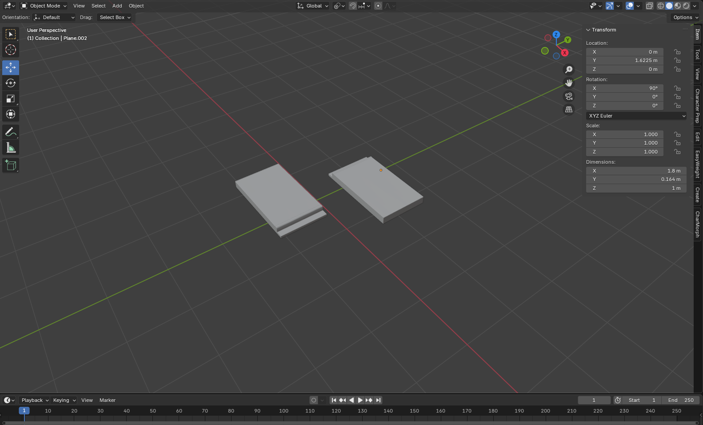

Repeat the process, select the segment, add another custom mesh, assign the new mesh (if you export in a new file remember to check read/write in the model tab), adjust the sidewalk to opposite side and now you have a nice sidewalk.  

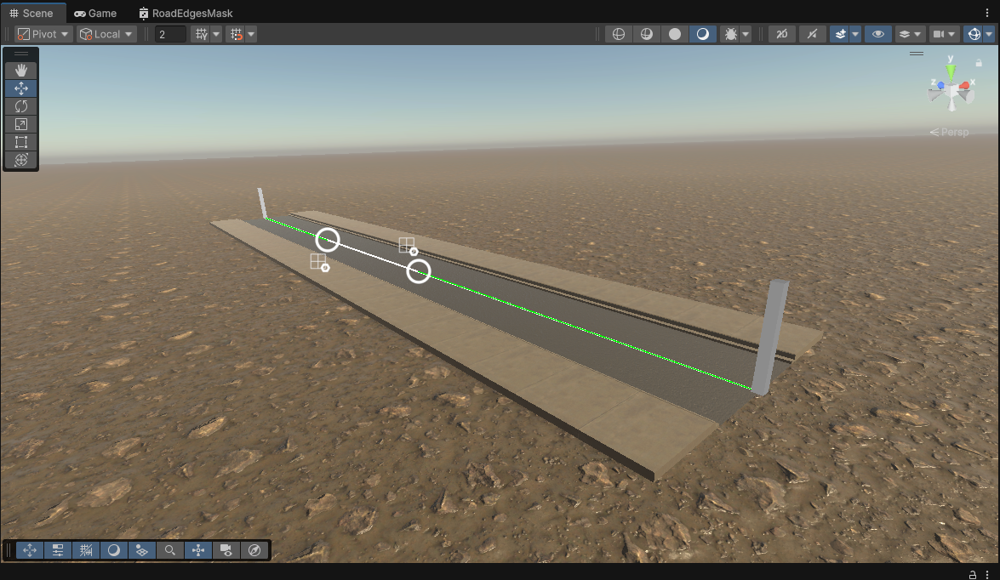

You can add as many custom meshes you want, don´t limit yourself only to side walks, Custom Meshes can align any Mesh, only you need to do is
make good orientation when you export, depending of the orientation and the position of vertices, you can create a loot of cool stuff.

### Connecting a Custom Mesh between two segments

You probably will need to make sidewalk in a intersection right? You can create Custom Mesh that can is a connection between two segments, let´s how to do!

Add a new sidewalk, you can do in any of the segments, don´t matter, after that find the segments you need to be connected in the inspector,
select the Custom Mesh you created, now drag and drop the segments in the "Start road segment" field and the "End road segment" field, after that Hanna Roads will create a curve between this two segments and bend the mesh along this new curve, at first time you can see som weird results, fix that adjusting the settings that will apear and the offset settings of Custom Mesh.

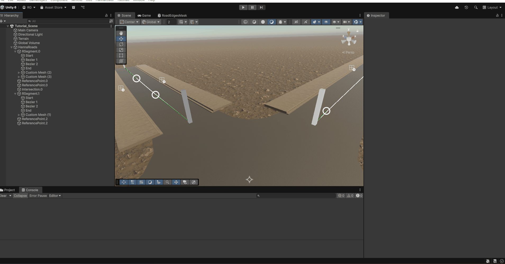

#### Flip start - end connection
What connections make is connect the start of the Start Road Field and the end of End Road field, but some times you need the start or the end of the roads, so you can mark "Use end of the segment as start" or "Use end of the segment as end" to flip start and end.

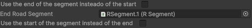

### Road Objects

If you want a object to follow some segment, you can add Road Object script to your object and make then follow the road, just drag and drop some segment in to RSegment field
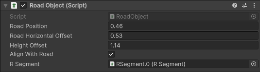

* Road Position : The position of the object in the road normalized, between 0 and 1.
* Road horizontal offset: is the offset of the object horizontally.
* Height Offset: The offset of the object in the road Y Axis.
* Align With the Road: Align object orientation with the road.
* R Segment: Is the segment that road will follow

If you find issues and problems feel free to create a issue, contributions will be well accepted! 
If you make a nice road, send to me! It´s will be great to put amazing images as showcase here! 
It´s that! A nice road system for free and open source! Thanks guys see you in the next updates!