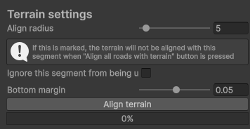
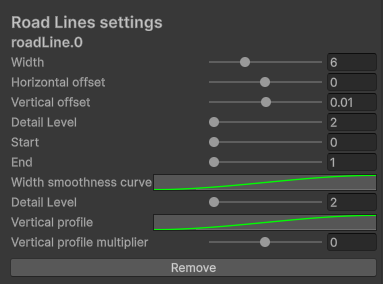
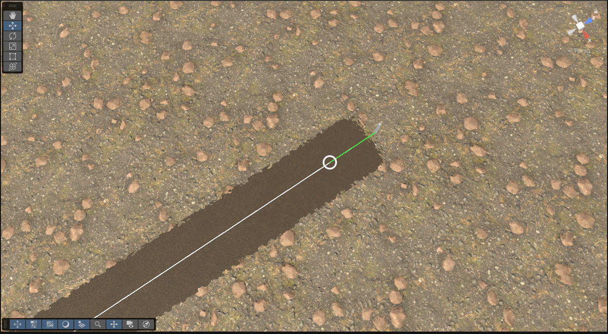

# Hanna Roads System

This is a Unity road system, with which you can build amazing roads with a lot of features! and it´s free!

### WARNING
The system does not currently have a LOD (Level of Detail) system. You may encounter some issues, so please use it with caution.

## Summary
* [How to use](#how-to-use)
  * [Creating a simple road system](#creating-a-simple-road-system)
  * [Controlling the road](#controlling-the-road)
  * [How connection works](#how-connection-works)
  * [Active Segment](#active-segment)
  * [Intersections](#intersections)
  * [Active Intersections](#active-intersections)
  * [Connecting separated roads and making loop roads](#connecting-separated-roads-and-making-loop-roads)
* [Geometry Customization](#geometry-customization)
  * [Road Segment Geometry Customization](#road-segment-geometry-customization)
  * [Affecting the previous road](#affecting-the-previous-road)
* [Terrain](#terrain)
* [Road Lines](#road-lines)
* [Custom Meshes](#custom-meshes)
  * [Connecting a Custom Mesh between two segments](#connecting-a-custom-mesh-between-two-segments)
* [Road Objects](#road-objects)
* [Shaders and vertex colors](#shader-and-vertex-colors)

## How to use

### Creating a simple road system

Go to the top menu, select **Hanna Roads**, and then **"Create Road System"**.

To start building a road, select the **HannaRoad** Object created in the hierarchy.

When you hold **Shift**, you will see a small wire cube.

Click with the left mouse button to create and keep holding **Shift** to choose where the end of the road will go.

To confirm the creation of the road, click with the left mouse button again, and voilà! A new amazing road! If you want to cancel, just release the **Shift** key.

### Controlling the road

When you create a new road, you will see circles with a green line and white cube towers. The roads are Bézier curves, and the circles are the controllers of the curve. When you move them, they will change the shape of the road, allowing you to create nice curves without needing to create more road segments. If you need to move the road, use the towers to change its shape.

You can delete roads freely. When you delete a road, it will disconnect from other roads. Remember, if you need to delete a road, delete the **segments**. Deleting reference points, control points, or other important objects can cause errors. If you accidentally delete one of these objects, delete the segment and create another one. You can mark another road as active and continue making more roads from it.

### How connection works

Hanna Roads can create connected and disconnected roads. After creating your first road, if you try to create another one, the start of the new road will be at the end of the previous one.

If you don't want this behavior, hold the **Alt** key while holding **Shift** before you click with the left mouse button for the first time. The wire cube will turn green, and you will be able to create a disconnected road.

### Active Segment

Hanna Roads has segments and intersections. When you create a road, you are creating a segment, which then becomes the "active segment". You can verify this by looking at the **Hanna Road** GameObject and checking the "Active Segment" field. You will also see an "Active Intersection" field (we will talk about that later). When you create a new connected road, Hanna Roads will use the active segment as the starting point.

If you need to start a new road from a different segment, you can simply select the desired segment and click **"Set as Active"**. When you return to the Hanna Roads object, you will see the "Active Segment" field has been updated.

### Intersections

Let's talk about intersections. You have multiple ways to create one; let's start with the easy way. Select your **Hanna Road** object. You will see a **"Change mode"** button. Change the mode to "Intersection" (you need to have at least one road in the scene to do this). The "Road mode" field will change to "Intersection".

After that, you have two options: create an intersection at the start of the road or at the end. Hold **Shift** and press **E** to create it at the end, or **S** to create it at the start. If the road is already connected to another road at one end, it will not be possible to create an intersection there.

### Creating at the end

#### Creating at the Start

After that, if you change the mode to "Intersection" and try to create another connected road, the start of the new road will be a point on the intersection. If you use the **mouse scroll wheel**, you will see the road change from one intersection connection point to another.

#### **Warning**

**_When you create a road that starts from an intersection, you will probably see two roads connected to the same connection point. Just scroll the mouse to change to another one.**_

If you need to change the connection later, you can select the white cube tower connected to the intersection (called a **Reference Point**). In its inspector, you can change the connection position using a slider.

### Active Intersections

Just as we have active segments, we also have active intersections. As you've seen, when an intersection is active and "Intersection" mode is selected, new roads start from it. But you can do more.

If you select a reference point and press **Shift + E**, it will attach to the active intersection, connecting the road with it.

If you want to disconnect, click on the **"Intersection connected"** field in the reference point's inspector and press the **Delete** key to remove the reference. Now you can move the reference point freely. You can also drag and drop an intersection object directly into this field.

When you select a reference point, you will see a button called **"Add Intersection"**. Pressing this button will create a new intersection at that point's position.

### Connecting separated roads and making loop roads

You will probably need to connect two separate roads or create road loops. To do that, select two reference points: one must be a start reference point and the other an end reference point. To identify them, you can select the reference point and check the "Segment Type" in the inspector, or look at the color of the towers (white is the start, a little bit darker is the end). After selecting both, click the **"Connect"** button in the inspector, and a new road will be created to connect them.

## Geometry Customization

With Hanna Roads, you can make cool things, but let's start from the basics.

### Road Segment Geometry Customization

When you select a segment, you will find some settings:

 - Width : Change the width of the road
 - Detail Level : Change the number of cuts(edges) of the road, more cuts, more detail
 - Horizontal detail level: Add cuts horizontally to the road creating extra detail, you will need that to create custom shapes.
- **Width**: Changes the width of the road.
- **Detail Level**: Changes the number of cuts (edges) of the road. More cuts mean more detail.
- **Horizontal detail level**: Adds horizontal cuts to the road, creating extra detail needed for custom shapes.

This is the basic, but that's boring. Let's make some cool stuff!

After the basic settings, you will see important settings for creating custom road shapes.

Okay, that's a lot of settings. Let's start with something easy so you can understand: let's change the height profile.

Wow! the road starts to bend!
This happens because of the height smoothness curve. Hanna Roads creates a shape based on this curve. If you change the curve, the shape of the road will change. With this, you can create complex shapes, adjusting them with the **Vertical Multiplier** and by increasing the **Horizontal Detail Level**. Cool, right?

But we can do more! Let's see what we can do with the width of the road.

If you open the **Width Smoothness Curve**, you will see a constant curve. Try to add some keyframes and make some changes.

See that? The width of the road starts to change along its length. The road's width is affected by this curve. If the curve is constant, nothing happens, but if you change it, it will affect the road width. You can adjust it further with the **Width Profile Multiplier**.

#### Affecting the previous road

Okay, that's great, but if we create another road and change its size or other shape settings, the previous one will be affected to create a smooth transition.

Hanna Roads creates a blend between some settings of the current road and the next one, but you can control that! You will see two fields called **"Start Curve Offset"** and **"End Curve Offset"**. These two values control when the transition to the next road will start and end, affecting properties like width, height curve, width curve, etc.

If you don't want a road to be affected by the next one, check **"Don't be affected for next road width shape"** or **"Don't be affected for next road height shape"**, and the road will not blend into the next one.

With these settings, you can create amazing and crazy roads!

### Terrain

For roads to blend naturally into your scene, they need to be aligned with the terrain. Here's how to achieve that. When you select a road segment, you will find the **"Terrain Settings"** section in its Inspector.

*   **Align Radius**: Controls the width of the area around the road that will be flattened to match its height.
*   **Ignore From Road System Terrain Update**: If checked, this segment will be skipped when using the global "Align all roads" function from the main Hanna Roads object.
*   **Bottom Margin**: The vertical distance to maintain between the road and the terrain. A positive value lowers the terrain relative to the road.

The **"Align Terrain"** button modifies the terrain underneath the selected segment based on these settings. While this process is generally effective, some minor manual adjustments to the terrain might be needed for perfect results.

### Road Lines

Road lines are meshes generated to create lines on the road or other elements like road shoulders. Let's create one!

Select a segment and press "Add Road Line". An additional mesh will appear on the road, and you will see the following settings for the newly created road line:

*   **Width**: Controls the width of the road line.
*   **Horizontal Offset**: Creates a horizontal offset from the center of the road.
*   **Vertical Offset**: Creates a vertical offset from the surface of the road.
*   **Detail Level**: The number of cuts along the length of the road line.
*   **Start**: Defines where the road line begins on the road segment's curve (from 0 to 1).
*   **End**: Defines where the road line finishes on the road segment's curve (from 0 to 1).
*   **Horizontal Resolution**: The number of horizontal cuts across the width of the road line.
*   **Vertical Profile**: A curve that defines the height profile across the width of the road line.
*   **Vertical Multiplier**: Multiplies the effect of the vertical profile curve.

You can select the Road Line GameObject (which is a child of the segment) and assign a different material to it. You can also adjust its offset and profile to create elements like a road shoulder.

### Custom Meshes

Okay, we've seen cool things, but let's do some more advanced stuff: Custom Meshes!
Custom meshes allow you to bend objects along the road. You can create sidewalks, for example. Let's make a nice sidewalk.

Open your favorite 3D software (I will use Blender). Now, make the sidewalk you want. The sidewalk will be a small segment that will then be repeated along the road.

Before exporting the model, we need to fix a few things. First, make the origin point the start of the sidewalk. Hanna Roads converts the Z-axis of the vertices' position to the Z-axis of the road (its length). To prevent negative positions, place your origin at a point where all vertices will be positive on the Z-axis.
It's not required for all vertices to be positive on the Z-axis, but for this example, we will need them to be.

As you can see in the Transform tab in Blender, the Y position of the vertex is positive. After exporting to Unity, the Y-axis will become the Z-axis, because in Blender the up-axis is Z, and in Unity, it is Y. After these changes, your model needs to have this orientation.

After that, to prevent rotation issues, rotate your model 90 degrees on the X-axis, then apply the rotation. Now you are ready to export.

After exporting your model, go back to Unity, select a road segment, and click **"Add custom mesh"**.

Now select the **Custom Mesh** created as a child of the road segment (rSegment).

In the Custom Mesh inspector, you will see some settings.

For now, let's add a simple mesh. Select your exported object, go to the **Model** tab in the inspector, and check the **Read/Write Enabled** checkbox.

Now you can grab your mesh and drag it into the **Original Mesh** field of the Custom Mesh.

Now you will see a nice sidewalk pop up in the scene! But the sidewalk isn't on the side of the street, is it? Let's fix that!

In the settings of the Custom Mesh, you can adjust the **Offset** of the sidewalk. Now you can put the sidewalk on the side of the road.

Cool! For the other side, export another mesh. You can export both meshes in the same file if you prefer. Go back to Blender, duplicate your sidewalk, and flip it to make the other side. Remember to maintain the correct orientation as you learned previously.

Repeat the process: select the segment, add another custom mesh, assign the new mesh (if you export in a new file, remember to check Read/Write Enabled in the model tab), adjust the sidewalk to the opposite side, and now you have a nice sidewalk.

You can add as many custom meshes as you want. Don't limit yourself to just sidewalks. Custom Meshes can align any mesh; you just need to ensure a good orientation when you export. Depending on the orientation and the position of the vertices, you can create a lot of cool stuff.

### Connecting a Custom Mesh between two segments

You will probably need to make a sidewalk in an intersection, right? You can create a Custom Mesh that acts as a connection between two segments. Let's see how to do it!

Add a new sidewalk to any of the segments; it doesn't matter which one. After that, in the Custom Mesh inspector, find the segments you need to connect. Drag and drop the segments into the **"Previous RSegment"** and **"Next RSegment"** fields. Hanna Roads will then create a curve between these two segments and bend the mesh along this new curve. At first, you might see some weird results; fix that by adjusting the settings that appear and the offset settings of the Custom Mesh.

#### Flip start - end connection
The connection links the end of the start segment to the start of the end segment. However, sometimes you need to use the start of the start segment or the end of the end segment. You can check **"Use End Of Segment"** for either the start or end segment to flip which end is used for the connection.

### Road Objects

If you want an object to follow a segment, you can add the **RoadObject** script to your object and make it follow the road. Just drag and drop a segment into the **RSegment** field.

* **Road Position**: The position of the object on the road, normalized between 0 and 1.
* **Road horizontal offset**: The horizontal offset of the object.
* **Height Offset**: The offset of the object on the road's Y-axis.
* **Align With the Road**: Aligns the object's orientation with the road.
* **R Segment**: The segment that the object will follow.

### Shader and Vertex Colors

When roads are created, Hanna Roads applies colors to the vertices so you can use them in your shaders. The first vertices of a segment are colored red and the last are colored blue. If a segment is attached to another segment, the vertex color will not be applied at the start or end, depending on where the other segment is connected.

In the Hanna Roads Shaders folder, you will find a shader called "RoadEdgesMask". This shader creates a mask at the start, end, and edges of the road.

### WARNING
*Road lines and intersections don´t have vertex colors!*

If you find any issues or problems, feel free to create an issue. Contributions are welcome!
If you make a nice road, send it to me! It would be great to put amazing images as showcases here!
That's it! A nice road system, free and open-source! Thanks, guys, and see you in the next updates!
